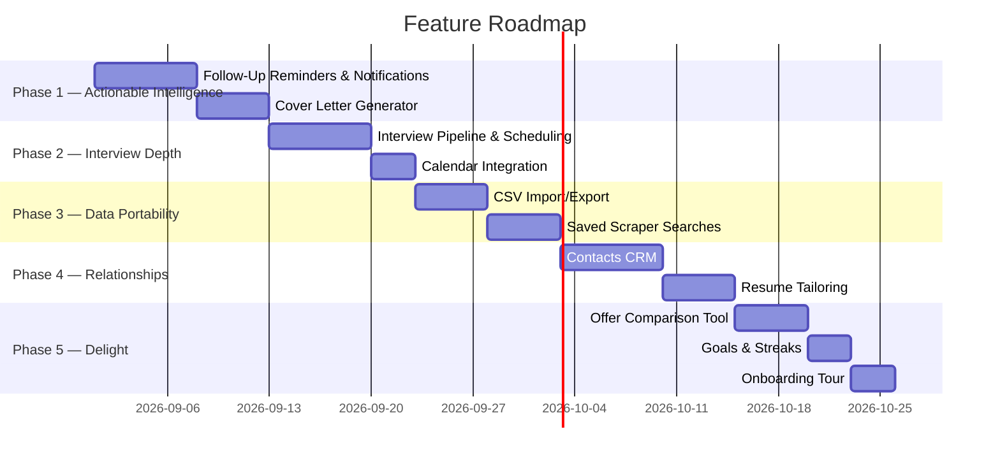

# Job Application Tracker — Platform Audit & Feature Brainstorm

## What's Already Built

Your platform is **far beyond MVP** — it's a feature-rich job search command center. Here's the full inventory:

### Core Tracking

| Feature                     | Details                                                                                                                       |
| --------------------------- | ----------------------------------------------------------------------------------------------------------------------------- |
| **Job Application CRUD**    | Full create/edit/delete with modal forms, side sheets for detail view                                                         |
| **7 Status Categories**     | `applied`, `review`, `interview`, `accepted`, `rejected`, `ghosted`, `other` — plus freeform status text within each category |
| **Data Table**              | TanStack Table with global search, status/platform filters via URL params (Nuqs), sorting, pagination                         |
| **Kanban Board**            | Visual drag-and-drop pipeline view with 5 columns (Applied → In Review → Interview → Accepted/Offer → Rejected/Ghosted)       |
| **Bulk Operations**         | Multi-select rows → bulk delete or bulk status category update via floating action bar                                        |
| **Activity Timeline**       | Per-application chronological status history with `application_status_history` table, deletable entries                       |
| **Auto-Ghosting Detection** | Applications in `applied`/`review` >30 days automatically flagged as ghosted                                                  |
| **Mobile Cards**            | Responsive mobile card layout with FAB button                                                                                 |

### AI & Extraction

| Feature                  | Details                                                                                                                                                                              |
| ------------------------ | ------------------------------------------------------------------------------------------------------------------------------------------------------------------------------------ |
| **AI Job URL Auto-Fill** | Paste a job URL → deterministic parsers for Greenhouse, Lever, Ashby, SmartRecruiters, Workday, Workable, LinkedIn, Indeed, JSON-LD (~80–150ms). Falls back to Gemini 2.5 Flash-Lite |
| **ATS Resume Checker**   | Gemini 2.5 Flash analysis: match score, 4 dimension sub-scores, keyword gap matrix, formatting checklist, Anti-AI bullet rewrites                                                    |
| **Strategy Coaching**    | Funnel bottleneck diagnostics comparing your conversion rates against market benchmarks                                                                                              |

### Analytics (Recharts)

| Feature                   | Details                                                                                                |
| ------------------------- | ------------------------------------------------------------------------------------------------------ |
| **KPI Summary**           | Total apps, active apps with stage pills, interview rate, interview conversion rate, avg response days |
| **Trend Charts**          | Monthly application volume bar chart, monthly status breakdown bar chart, yearly toggle                |
| **Platform ROI**          | Stacked status bar chart per platform, yield metrics, sortable performance tables                      |
| **Best Platform Insight** | Auto-identifies highest-yield platform with conversion multiplier vs. second best                      |
| **Ghosting Risk**         | Stale applications (>30 days) and follow-up candidates (7–14 days) with top companies                  |
| **Funnel Bottleneck**     | Resume vs. interview pass rates against industry benchmarks                                            |
| **Strategic Insights**    | Role targeting distribution, black hole breakdown (ghosted vs. rejected), ATS domain leaderboard       |
| **Year/Month Filters**    | All analytics filterable by year and month via URL params                                              |

### Documents & Resumes

| Feature                 | Details                                                          |
| ----------------------- | ---------------------------------------------------------------- |
| **S3 Upload**           | Drag-and-drop PDF upload with presigned URLs, file size tracking |
| **Document Categories** | Resume, cover letter, portfolio, other                           |
| **Table & Grid Views**  | Switchable layout with search filtering                          |
| **View/Download**       | In-browser PDF viewing and direct download via presigned URLs    |

### Platform & UX

| Feature                | Details                                                                                        |
| ---------------------- | ---------------------------------------------------------------------------------------------- |
| **Auth**               | Clerk sign-in/sign-up with protected routes                                                    |
| **Guest Mode**         | Anonymous tracking with guest UUID cookie → auto-migrates all data to Clerk account on sign-up |
| **Dark Mode**          | Full light/dark/system theme support                                                           |
| **Landing Page**       | Marketing page with hero, features, how-it-works, CTA                                          |
| **Responsive Design**  | Desktop sidebar nav + mobile drawer, mobile-optimized cards                                    |
| **Smart Autocomplete** | Combobox inputs for platforms and locations with user-derived suggestions                      |
| **404 Page**           | Custom not-found page                                                                          |

---

## What's Actually Missing — Revised Brainstorm

### 🔴 High Impact

#### 1. Interview Pipeline & Scheduling

The `interview` status category exists, but there's no structured interview tracking.

- **Interview sub-stages**: Phone Screen → Technical → Behavioral → On-site → Final Round
- **Interview details**: Date/time, location or video link, interviewer name/title, format (live coding, system design, etc.)
- **Interview prep notes**: Per-round notes, questions to ask, topics to review
- **Calendar integration**: Add interview to Google Calendar / Outlook with one click
- **Pre-interview reminders**: Notification before scheduled interviews

#### 2. Follow-Up & Reminder System

The analytics already flag follow-up candidates (7–14 days) and stale apps (>30 days), but there's no actionable reminder system.

- **Actionable follow-up prompts**: "Send follow-up email" button → opens email template or compose link
- **Custom reminders**: Set a reminder for any date with a custom message on any application
- **In-app notification center**: Bell icon with unread count, list of due reminders and suggested follow-ups
- **Email/push notifications**: Optional email digest of upcoming actions

#### 3. Contacts & Networking CRM

No contact management beyond what's on the job posting itself.

- **Contacts table**: Name, email, phone, LinkedIn URL, company, title, relationship type (recruiter, hiring manager, referral, peer)
- **Link contacts to applications**: "Jane Smith (recruiter) → 3 applications at Google"
- **Interaction log**: "Emailed Jun 3", "Had coffee chat Jun 10", "LinkedIn message Jun 15"
- **Referral tracking**: Which contacts referred you, and the outcome

---

### 🟡 Medium Impact

#### 4. CSV/Excel Import & Export

- **Import from spreadsheet**: Many job seekers start in Google Sheets — let them migrate in
- **Export all data**: CSV/Excel/JSON backup of applications, analytics snapshot
- **Column mapping wizard**: Map spreadsheet columns to application fields during import

#### 5. Saved Searches & Job Alerts

The scraper exists but searches are one-off.

- **Save search configurations**: "Senior Frontend, Remote, LinkedIn" as a reusable saved search
- **Scheduled scraping**: Run saved searches on a daily/weekly cron
- **New job notifications**: Alert when new matches appear since last scrape
- **Dedup against existing applications**: Don't show jobs already in your tracker

#### 6. Cover Letter Generator

The landing page advertises it as a feature, but there's no cover letter generation tool in the current codebase — only the ATS resume checker exists under AI tools.

- **Resume + JD → cover letter**: Select a saved resume, paste the job description, generate a tailored cover letter
- **Tone/style options**: Professional, conversational, technical
- **Save as document**: Store generated cover letters in the documents system
- **Edit & regenerate**: Iterate on specific paragraphs

#### 7. Resume Tailoring Suggestions

The ATS checker identifies keyword gaps — take it one step further.

- **AI-powered resume variant generator**: "Create a version of my resume optimized for this specific JD"
- **Per-application resume tracking**: "For this Google application I used Resume v3"
- **Diff view**: Side-by-side comparison of resume versions

---

### 🟢 Nice to Have

#### 8. Offer Comparison Tool

- **Structured offer details**: Base salary, bonus, equity/RSUs, benefits, PTO, signing bonus
- **Side-by-side comparison** table across multiple offers
- **Total compensation calculator** with vesting schedules
- **Cost of living adjustment** by location

#### 9. Goal Setting & Streaks

- **Weekly/monthly targets**: "Apply to 10 jobs this week"
- **Progress bar** toward current goal
- **Application streaks**: "5-day streak 🔥" gamification
- **Milestone celebrations**: "50th application!" "First offer!" confetti moments

#### 10. Email Integration

- **Email templates**: Follow-up templates, thank-you notes, negotiation scripts with smart placeholders
- **Send via deep link**: Pre-filled Gmail/Outlook compose links
- **Parse confirmation emails**: Auto-detect "Thank you for applying" emails (ambitious)

#### 11. Browser Extension

- **"Save Job" button** overlay on LinkedIn / Indeed / Glassdoor pages
- **Auto-detect** when you're viewing a job posting and offer one-click save
- **Mark jobs as "already applied"** with visual indicator on job boards

#### 12. Onboarding & Empty States

- **Guided onboarding tour**: Highlight key features for first-time users
- **Sample data mode**: Demo the platform with fake applications before the user adds their own
- **Contextual tips**: "You have 5 apps with no status update in 2 weeks — check the Analytics page"

#### 13. Mobile PWA

- **Installable** as a progressive web app
- **Push notifications** for reminders
- **Quick-add** from mobile home screen

---

## Suggested Priority Roadmap

---

## What You've Already Nailed

> [!TIP]
> Your platform is **genuinely impressive**. The combination of:
>
> - **Deterministic parsers** for 8+ ATS platforms (Greenhouse, Lever, Ashby, etc.) with AI fallback
> - **Guest mode** with seamless data migration on sign-up
> - **Auto-ghosting detection** with follow-up candidate flagging
> - **Strategy coaching** with market benchmark comparisons
> - **Kanban + Table** dual views with URL-synced filters
>
> ...puts this well beyond a typical job tracker. You've built the analytical backbone — the remaining gaps are mostly about **actionability** (reminders, interviews, contacts) and **data portability** (import/export).

> [!NOTE]
> The highest-ROI additions are **Follow-Up Reminders** and **Interview Pipeline** — they're the features that turn passive tracking into active job search management.
