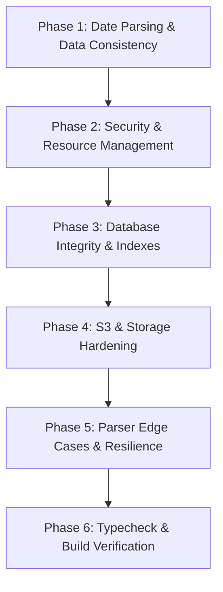

# Backend Implementation & Defect Remediation Plan

This execution plan provides a step-by-step blueprint to resolve all 13 defects, edge cases, and vulnerabilities discovered during the backend audit and QA inspection of the **Job Application Tracker** (Next.js 16.3 / React 19.2 / Drizzle ORM / PostgreSQL).

---

## 1. Plan Overview & Execution Phases

---

## Phase 1: Date Parsing, Ghosting Consistency & Month/Year Shift

### Goal
Eliminate timezone offset data corruption (applications created on the 1st of any month saving under the previous month/year in Western timezones) and resolve conflicting Ghosting KPI calculations.

### Tasks
- [ ] **Fix Month/Year Extraction in Application Mutations**
  - **File**: [`app/actions/applications.ts`](file:///C:/Users/ethan/Development/job-application-tracker/app/actions/applications.ts)
  - **Implementation**: In [`createApplication`](file:///C:/Users/ethan/Development/job-application-tracker/app/actions/applications.ts#L105) and [`updateApplication`](file:///C:/Users/ethan/Development/job-application-tracker/app/actions/applications.ts#L146), replace `format(new Date(date_applied), ...)` with timezone-safe string parsing (`const [year, monthStr] = date_applied.split("-"); const month = parseInt(monthStr, 10).toString();`).
- [ ] **Unify Ghosting Logic Across Analytics**
  - **File**: [`app/actions/analytics.ts`](file:///C:/Users/ethan/Development/job-application-tracker/app/actions/analytics.ts)
  - **Implementation**: Standardize [`getGhostedApplications`](file:///C:/Users/ethan/Development/job-application-tracker/app/actions/analytics.ts#L125) and [`getDetailedApplicationBreakdown`](file:///C:/Users/ethan/Development/job-application-tracker/app/actions/analytics.ts#L445) to use `differenceInDays(new Date(), parseISO(app.date_applied)) >= 30` so KPI summaries and ghosted cards always match.
- [ ] **Fix Timeline History Timestamp Sanitization**
  - **File**: [`app/actions/applications.ts`](file:///C:/Users/ethan/Development/job-application-tracker/app/actions/applications.ts)
  - **Implementation**: In [`getApplicationHistory`](file:///C:/Users/ethan/Development/job-application-tracker/app/actions/applications.ts#L234), remove hardcoded hour matching (`00:00`, `03:00`, `12:00`) that inadvertently overwrites genuine timestamps.

---

## Phase 2: Security Hardening & Resource Lifecycle

### Goal
Prevent Server-Side Request Forgery (SSRF) and eliminate orphaned headless Chromium process memory leaks.

### Tasks
- [ ] **Implement SSRF Protection in Extraction Route**
  - **File**: [`app/api/extract/route.ts`](file:///C:/Users/ethan/Development/job-application-tracker/app/api/extract/route.ts)
  - **Implementation**: Add `isSafePublicUrl(url)` validator blocking loopback (`127.0.0.1`, `localhost`), link-local metadata (`169.254.169.254`), and private RFC 1918 subnets (`10.0.0.0/8`, `172.16.0.0/12`, `192.168.0.0/16`). Return a 400 Bad Request if the URL is invalid or blocked.
- [ ] **Guarantee Browser Termination in Scraper**
  - **File**: [`lib/scraper.ts`](file:///C:/Users/ethan/Development/job-application-tracker/lib/scraper.ts)
  - **Implementation**: Enclose Playwright browser launch and context execution in a strict `try...finally` block to guarantee `await browser.close()` executes even upon navigation timeout.

---

## Phase 3: Database Integrity, Indexes & Schema Registration

### Goal
Prevent partial data migrations, optimize query join performance, and register all schema tables.

### Tasks
- [ ] **Wrap Guest Migration in Database Transaction**
  - **File**: [`app/actions/migrate-user-data.ts`](file:///C:/Users/ethan/Development/job-application-tracker/app/actions/migrate-user-data.ts)
  - **Implementation**: Wrap `jobApplications` and `documents` updates inside `await db.transaction(async (tx) => { ... })`.
- [ ] **Register Status History Schema Table**
  - **File**: [`app/db/index.ts`](file:///C:/Users/ethan/Development/job-application-tracker/app/db/index.ts)
  - **Implementation**: Add `applicationStatusHistory` into the schema definition object passed to `drizzle(sql, { schema: ... })`.
- [ ] **Add Composite Performance Indexes**
  - **File**: [`app/db/schema.ts`](file:///C:/Users/ethan/Development/job-application-tracker/app/db/schema.ts)
  - **Implementation**: Add `job_apps_user_idx` (`userId`), `job_apps_user_date_idx` (`userId, date_applied`), and `status_history_app_id_idx` (`applicationId`). Run `npx drizzle-kit generate` to create the migration.

---

## Phase 4: S3 Key Validation, Sanitization & Document Safety

### Goal
Prevent S3 key path tampering, DB truncation errors, and invalid URI characters in storage keys.

### Tasks
- [ ] **Sanitize File Names in S3 Presigned URL Generator**
  - **File**: [`app/actions/documents.ts`](file:///C:/Users/ethan/Development/job-application-tracker/app/actions/documents.ts)
  - **Implementation**: In [`generatePresignedUrl`](file:///C:/Users/ethan/Development/job-application-tracker/app/actions/documents.ts#L15), clean file names with `fileName.replace(/[^a-zA-Z0-9._-]/g, "_")`.
- [ ] **Validate Key Prefix and Category Length in Document Creation**
  - **File**: [`app/actions/documents.ts`](file:///C:/Users/ethan/Development/job-application-tracker/app/actions/documents.ts)
  - **Implementation**: In [`createFile`](file:///C:/Users/ethan/Development/job-application-tracker/app/actions/documents.ts#L59), verify `file_key.startsWith(`${userId}/`)` and truncate `category` to 32 characters (`category.slice(0, 32)`).

---

## Phase 5: Deterministic Parser Edge Cases & Analytics Metrics

### Goal
Improve extraction coverage across edge cases and fix metric division boundary conditions.

### Tasks
- [ ] **Support Alphanumeric Greenhouse Job Tokens**
  - **File**: [`lib/parsers/greenhouse.ts`](file:///C:/Users/ethan/Development/job-application-tracker/lib/parsers/greenhouse.ts)
  - **Implementation**: Update regex pattern from `\d+` to `[a-zA-Z0-9_-]+` to support UUIDs and alphanumeric job slugs.
- [ ] **Guard Against Undefined Lever Job IDs**
  - **File**: [`lib/parsers/lever.ts`](file:///C:/Users/ethan/Development/job-application-tracker/lib/parsers/lever.ts)
  - **Implementation**: Avoid issuing public API GET requests if `jobId` is missing or equal to `"undefined"`.
- [ ] **Add Null Guard in Role Insights Normalization**
  - **File**: [`app/(pages)/analytics/insights/actions.ts`](file:///C:/Users/ethan/Development/job-application-tracker/app/%28pages%29/analytics/insights/actions.ts)
  - **Implementation**: In [`getRoleTargetingAnalysis`](file:///C:/Users/ethan/Development/job-application-tracker/app/%28pages%29/analytics/insights/actions.ts#L101), add fallback `(app.roleName || "").toLowerCase().trim()`.
- [ ] **Fix Platform Multiplier Edge Case**
  - **File**: [`app/actions/analytics.ts`](file:///C:/Users/ethan/Development/job-application-tracker/app/actions/analytics.ts)
  - **Implementation**: In [`getBestPlatformInsight`](file:///C:/Users/ethan/Development/job-application-tracker/app/actions/analytics.ts#L773), handle cases where `secondBest.interviewRate === 0` by avoiding collapsing to `1.0x`.

---

## Phase 6: Empirical Verification & Regression Testing

### Commands to Run
1. `npx tsc --noEmit` — Verify strict TypeScript compilation with zero type errors.
2. `npx drizzle-kit generate` — Generate SQL migration for added database indexes.
3. `npm run build` — Verify optimized production build with Next.js 16 Turbopack and dynamic route rendering.

